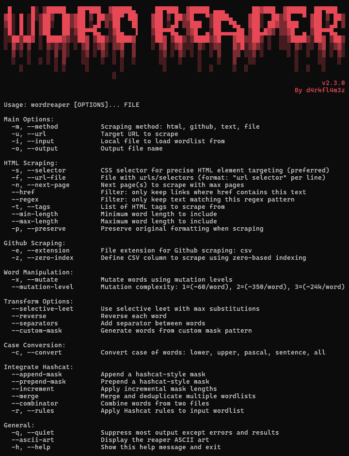

<h1 align="left">wordreaper</h1>


## About the Project

This tool is designed to scrape and format highly focused wordlists<br> 
for password cracking, utilizing CSS selectors for surgical precision.

---

## Install
```bash
git clone https://github.com/Nemorous/wordreaper.git
cd wordreaper
pip install .
```

---

## Usage


<i>For more usage information, please refer to [`EXAMPLES.md`](EXAMPLES.md)</i>


---

## 📝 Changelog

See [`CHANGELOG.md`](CHANGELOG.md)

---

## 📁 License

MIT, see [`LICENSE`](LICENSE) file

---

## 🤝 Contributions

PRs and issues welcome! Add new scrapers, modules, or mutation strategies.

Made with ☕ and 🔥 By d4rkfl4m3z

