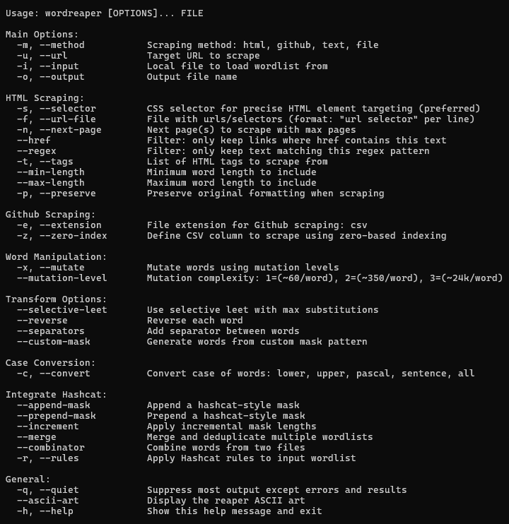

<h1 align="center">wordreaper</h1>

<p align="center">
  
</p>


## About the Project

This tool is designed to scrape and format highly focused wordlists<br> 
for password cracking, utilizing CSS selectors for surgical precision.

<details>
  <summary>Features Overview</summary>

<br>

- **HTML scraping**
  - Extracts text using precise CSS selectors  
  - Supports targeted scraping from any HTML source  

- **GitHub/Gist/CVS wordlist pulling**
  - Fetches raw files directly from GitHub repos, Gists, or CVS platforms  
  - Allows automatic integration of community-maintained wordlists  

- **Plaintext scraping**
  - Parses simple newline-based text lists  
  - Great for quick ingestion of CTF-provided dictionaries or OSINT dumps  

- **File loading from local environment**
  - Reads local files as input wordlists  
  - Supports multiple formats, line-by-line parsing, and error resistance  

- **Common mutations**
  - Performs case flips, character swaps, leetspeak, and other common transforms  
  - Adjustable complexity levels for targeted output sizes  

- **Mask-based permutations (Hashcat-style)**
  - Fully supports ?l ?u ?d ?s and custom character sets  
  - Generates exhaustive permutations using mask notation  

- **Prepend/Append operations**
  - Adds prefixes or suffixes to each word  
  - Can increment numerically for password-pattern simulation  

- **Wordlist merging & combinator functionality**
  - Combines two or more lists into hybrid forms  
  - Useful for username:word, domain:keyword, or multi-stage list generation  

- **Rule support (Hashcat-style or custom)**
  - Reads rule files and applies transformations exactly as Hashcat would  
  - Supports your own rule definitions for maximum flexibility  

- **Case conversion**
  - Converts words to lower, upper, PascalCase, Sentence case, etc.  
  - Helps normalize or systematically diversify output  

- **Advanced transforms**
  - Selective leetspeak, reverse string, add separators, sanitize characters  
  - Useful for human-pattern password generation  

- **Custom mask output for CTF flag formats**
  - Tailored mask generation for formats like `FLAG{...}`, `HTB{...}`, etc.  
  - Great for solving wordlist-based cracking challenges in CTF events  

</details>

---

## Install
```bash
git clone https://github.com/Nemorous/wordreaper.git
cd wordreaper
pip install .
```

---

## Usage


<i>For more usage information, please refer to [`EXAMPLES.md`](EXAMPLES.md)</i>


---

## Changelog

See [`CHANGELOG.md`](CHANGELOG.md)

---

## License

MIT [`LICENSE`](LICENSE)

---

## Contributions

PRs and issues welcome! Add new scrapers, modules, or mutation strategies.

> Made with ☕ and 🔥 By d4rkfl4m3z

